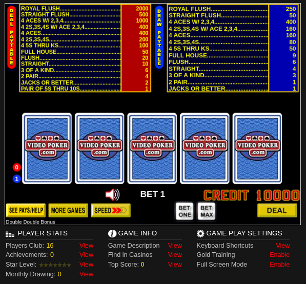

# DDB video poker backend
비디오 포커란, 온라인 포커 중 가장 기본적인 포커로 조커를 제외한 52장의 카드로 진행한다.
그 중, DDB (Double Down Bonus) 게임은 Four of a Kind 핸드에 대해서 더 높은 지불금을 제공하는 주는 변형 게임이다. 
해당 프로젝트에서는 Kotlin과 Spring을 활용하여 싱글핸드의 백엔드 시스템을 개발한다.
## 게임 설명
### 룰
1. 5장의 패를 받는다
2. 플레이어는 카드를 선택한다.
3. 선택하지 않은 카드는 임의의 새로운 카드로 교체한다.
4. 족보에 따라 배팅 금액을 받는다.
### 용어
* 
### 전략
1. 수익성이 높은 paytable을 찾는다
2. 족보에 따라 받는 배팅액을 확인한다
3. 전략을 암기한다

 

---
## 구현 설명
### 구현 기능
* 회원 : 가입/탈퇴/조회 기능
* 게임 : 시작/홀드 기능

### 구현 범위에 대한 상세 설명
* 회원의 초기 코인은 100개라고 둔다.
* 100개를 소진한 경우, 플레이를 할 수 없다.
* paytable은 deal, draw 두종류를 제공한다. 
* 배팅 값에 따라, paytable 적용값이 다르다. 
* <b>동접자수 테스트를 실행한다.</b> 

### 화면 예시
1. 플레이 화면

   
   * 용어 설명
     - `deal paytable` : 처음 나온 5개의 카드에 대해 주는 페이테이블이다. 왼쪽 빨간색 동그라미에 `BET`를 하나씩 추가하면서 활성화할 수 있다.
     - `draw paytable` : 5장의 카드를 `held`(고정)하여 새로 받았을 때의 페이테이블이다. 왼족 파란색 동그라미에 `BET`를 하나씩 추가하면서 활성화할 수 있다.
     - `hand` : 주어진 카드이다. 카드가 주어지면 `held`할 수 있고, 버리고 랜덤카드를 받을 수도 있다.
     - `deck` : 조커를 제외한 52장의 포커 카드이다.
     - `bet` : 배팅 수다. 배팅에 따라 `paytable`이 달라진다

### UML
1. 유스케이스 다이어그램

    사용자와 시스템이 상호작용하는 유스케이스 다이어그램은 다음 그림과 같다.
    
2. 시퀀스 다이어그램

   게임 시작시, 작업의 흐름 시퀀스 다이어그램은 다음 그림과 같다.
   4

   글로 표현하면 다음과 같다
   1. 게임 시작
       * BET 설정 후, DEAL을 하면 게임이 시작된다.
         * BET 설정에 따라 paytable이 달라진다.
       * 처음 나온 5 hands로 deal paytable이 결정된다. 
   2. 카드 랜덤 받기 
       * 플레이어는 5 hands 중에서 원하는 카드를 전략에 따라 held한다.
       * held되지 않는 카드는 deck에서 랜덤으로 카드를 다시 제공한다.
       * 다시 나온 카드로 draw paytable이 결정된다. 
   3. payout 계산받기
       * draw, deal paytable로 총 WIN이 결정되고, 유저의 CREDIT에 추가된다.
       * 1~6번을 반복한다. 만약 CREDIT이 0보다 작거나 같다면, 결제창으로 간다.